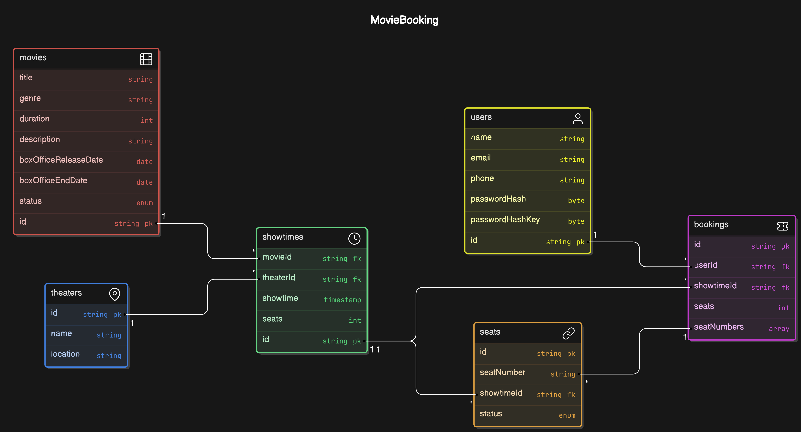

# Movie Ticket Booking System

## 1. Requirements

### Functional Requirements

- User Registration and Authentication
- Movie Listings
- Show Timings
- Seat Selection
- Payment Integration(Extra)
- Booking Confirmation
- User Profile and Booking History

## 2. System Architecture
### 2.1. Backend

- **ASP.NET Core**: For handling business logic and API endpoints.
- **Entity Framework Core**: For database operations and ORM.

### 2.2. Database

- **SQL Server**: For storing all the application data.

### 2.3. Authentication

- Use **ASP.NET Identity** for user authentication and authorization.

## 3. API Design

### 3.1. User APIs

- **POST** /api/users/register: Register a new user.
- **POST** /api/users/login: Authenticate a user.
- **GET** /api/users/profile: Get user profile.
- **GET** /api/users/bookings: Get user booking history.

### 3.2. Movie APIs

- **GET** /api/movies: Get a list of movies.
- **GET** /api/movies/{id}: Get details of a specific movie.

### 3.3. ShowTime APIs

- **GET** /api/showtimes: Get showtimes for all movies.
- **GET** /api/showtimes/{id}: Get showtimes for a specific movie.

### 3.4. Booking APIs

- **POST** /api/bookings: Create a new booking.
- **GET** /api/bookings/{id}: Get booking details.

## 4. Endpoints

### Admin Endpoints
Admin endpoints are used by administrators to manage the system. These endpoints often include CRUD (Create, Read, Update, Delete) operations for movies, showtimes, theaters, and user management.
#### Movie Management
- **POST** /api/admin/movies: Add a new movie.
- **PUT** /api/admin/movies/{id}: Update movie details.
- **DELETE** /api/admin/movies/{id}: Delete a movie.
- **GET** /api/admin/movies: Get a list of all movies (with detailed administrative info).

#### Showtime Management
- **POST** /api/admin/showtimes: Add a new showtime.
- **PUT** /api/admin/showtimes/{id}: Update showtime details.
- **DELETE** /api/admin/showtimes/{id}: Delete a showtime.
- **GET** /api/admin/showtimes: Get a list of all showtimes (with detailed administrative info).

#### Theater Management
- **POST** /api/admin/theaters: Add a new theater.
- **PUT** /api/admin/theaters/{id}: Update theater details.
- **DELETE** /api/admin/theaters/{id}: Delete a theater.
- **GET** /api/admin/theaters: Get a list of all theaters.

#### Booking Management
- **GET** /api/admin/bookings: Get a list of all bookings.
- **GET** /api/admin/bookings/{id}: Get details of a specific booking.
- **DELETE** /api/admin/bookings/{id}: Cancel a booking.

### Customer Endpoints
Customer endpoints are used by regular users of the system to browse movies, book tickets, and manage their profiles.
#### User Management
- **POST** /api/users/register: Register a new user.
- **POST** /api/users/login: Authenticate a user.
- **GET** /api/users/profile: Get user profile details.
- **PUT** /api/users/profile: Update user profile details.
- **GET** /api/users/bookings: Get user booking history.

#### Movie Browsing
- **GET** /api/movies: Get a list of movies.
- **GET** /api/movies/{id}: Get details of a specific movie.

#### Showtime Browsing
- **GET** /api/showtimes: Get showtimes for all movies.
- **GET** /api/showtimes/{id}: Get showtimes for a specific movie.

#### Booking
- **POST** /api/bookings: Create a new booking.
- **GET** /api/bookings/{id}: Get booking details.
- **PUT** /api/bookings/{id}: Update a booking (if allowed).
- **DELETE** /api/bookings/{id}: Cancel a booking (if allowed).

#### Payments(extra)
- **POST** /api/payments: Process a payment.
- **GET** /api/payments/{id}: Get payment details.

### 5. Class Diagrams
