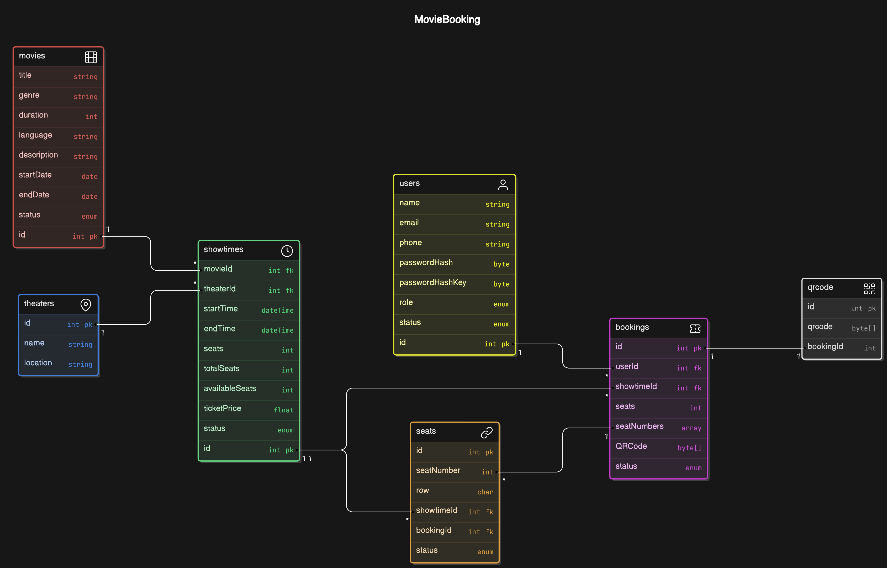

# AceTickets

AceTickets is a comprehensive movie booking application that includes both backend and frontend components. The backend handles all server-side operations such as user authentication, movie management, showtime scheduling, booking services, and theater management. The frontend provides a seamless user interface for browsing movies, booking tickets, and managing user accounts.

## Table of Contents

- [Project Overview](#project-overview)
- [Class Diagram](#class-diagram)
- [Backend](#backend)
  - [Features](#features)
  - [Technologies Used](#technologies-used)
  - [API Endpoints](#api-endpoints)
- [Frontend](#frontend)
  - [Features](#features-1)
  - [Technologies Used](#technologies-used-1)
- [Installation](#installation)
- [Usage](#usage)
- [Contributing](#contributing)
- [License](#license)

## Project Overview

AceTickets provides an end-to-end solution for movie ticket booking, from browsing movies to managing bookings and user accounts. The system is built with a robust backend and a responsive frontend.

## Class Diagram

## Backend

### Features

- **User Authentication**: Registration, login, and user management.
- **Movie Management**: Adding, updating, and deleting movies.
- **Showtime Scheduling**: Managing showtimes for different theaters.
- **Booking Management**: Handling bookings and seat allocations.
- **Theater Management**: Managing theater details and seating arrangements.
- **Email Verification**: Sending verification emails to users.
- **CRON Jobs**: Automatic updates for movie and showtime statuses.

### Technologies Used

- C#
- ASP.NET Core
- Entity Framework Core
- Quartz.NET for scheduling CRON jobs
- Docker

### API Endpoints

#### User Authentication

- **POST** `/api/auth/register`: Register a new user.
- **POST** `/api/auth/register-admin`: Register a new admin user.
- **POST** `/api/auth/login`: User login.
- **PUT** `/api/auth/password`: Update user password.
- **POST** `/api/auth/logout`: User logout.
- **POST** `/api/auth/verify/generateCode`: Generate a verification code.
- **POST** `/api/auth/verify/verifyCode/{verificationCode}`: Verify the provided verification code.

#### User Management

- **GET** `/api/users`: Get all users.
- **GET** `/api/users/customers`: Get all customer users.
- **GET** `/api/users/admins`: Get all admin users.
- **GET** `/api/users/id/{id}`: Get user by ID.
- **GET** `/api/users/email/{email}`: Get user by email.
- **PUT** `/api/users`: Update user details.

#### Movie Management

- **POST** `/api/movies`: Add a new movie.
- **GET** `/api/movies`: Get all movies.
- **GET** `/api/movies/running`: Get running movies.
- **GET** `/api/movies/byLanguages`: Get movies by languages.
- **PUT** `/api/movies`: Update movie details.
- **GET** `/api/movies/movie/{movieName}`: Get movie by name.

#### Showtime Management

- **POST** `/api/showtimes`: Add a new showtime.
- **GET** `/api/showtimes`: Get all showtimes.
- **GET** `/api/showtimes/{id}`: Get showtime by ID.
- **PUT** `/api/showtimes/status`: Update showtime status.
- **GET** `/api/showtimes/theatre/{theatreName}`: Get showtimes by theater name.
- **GET** `/api/showtimes/seats/{showtimeId}`: Get seats for a showtime.

#### Booking Management

- **POST** `/api/bookings`: Add a new booking.
- **GET** `/api/bookings`: Get all bookings.
- **GET** `/api/bookings/{id}`: Get booking by ID.

#### Theater Management

- **POST** `/api/theatres`: Add a new theater.
- **GET** `/api/theatres`: Get all theaters.
- **GET** `/api/theatres/{id}`: Get theater by ID.
- **GET** `/api/theatres/locations`: Get all theater locations.
- **PUT** `/api/theatres`: Update theater details.

## Frontend

### Features

- **Movie Browsing**: View available movies and showtimes.
- **Ticket Booking**: Book tickets for selected movies and showtimes.
- **User Authentication**: Register, login, and manage user accounts.
- **Responsive Design**: Optimized for both desktop and mobile devices.
- **State Management**: Efficient state management using Redux.
- **UI Components**: Styled with Bootstrap for a consistent and responsive design.

### Technologies Used

- React
- Redux
- Bootstrap
- Vite
- React Router
- Axios

## Repositories

### Backend Repository

The backend repository can be found [here](https://github.com/ash0306/AceTickets-Backend)

### Frontend Repository

The frontend repository can be found [here](https://github.com/ash0306/AceTickets-Frontend)